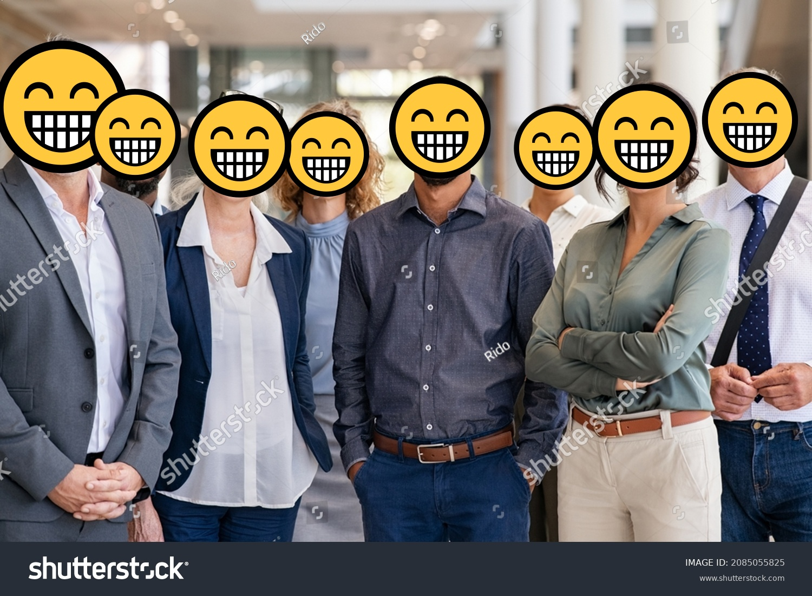
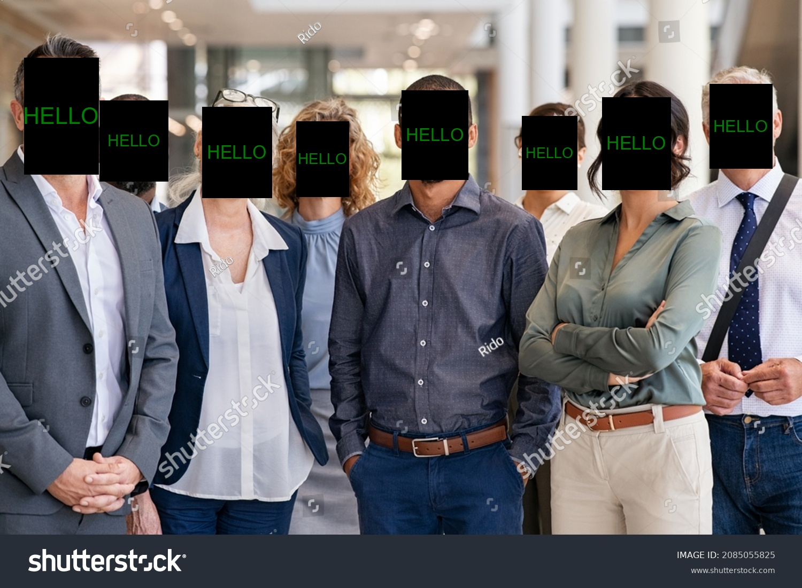

# Face Detection and Censoring System

A Python-based system for detecting faces in images and videos using YOLOv8, with the ability to censor detected faces. The system is designed to be modular and extensible.

## Features

- Face detection using YOLOv8
- Support for both image and video processing
- Easy to use User Interface
- Modular censoring system
- Trained on the WIDER FACE dataset via Roboflow
- Multiple masking methods including: blur, emoji, and text (see [demo](#demo))

## Local Installation

### With Docker 🐋
1. Pull the image:
```bash
docker pull spring93/face-censor
```

2. Run:
```bash
docker run -p 3000:7860 -it --gpus all spring93/face-censor
```

3. Navigate to `http://localhost:3000` from your browser.

### Without Docker
1. Clone the repository:
```bash
git clone https://github.com/Spring-0/face-censor.git
cd face-censor
```

2. Create a virtual environment and activate it:
```bash
python -m venv .venv
source .venv/bin/activate  # On Windows, use: .venv\Scripts\activate
```

3. Install the required packages:
```bash
pip install -r requirements.txt
```

4. Run:
```bash
python src/main.py
```

## Training the Model - Optional

The project uses the WIDER FACE dataset from Roboflow for training. I have included a pre-trained model, so there is no need to re-train it unless you want to. Here is how:

1. Update this line in `training/training.py` if required:
```python
device="0"  # Set to "0" to utilize GPU, otherwise set to "cpu" to utilize CPU
```

2. Create a `.env` file in the project root with your Roboflow API key:
```bash
ROBOFLOW_API_KEY=your_api_key_here
```

3. Run the training script:
```bash
cd training
python3 training.py
```

## Usage

### API Usage
```python
# Face detection model
from models.yolo_detector import YOLOFaceDetector

# Masking methods (no need to import all, just what you want to use)
from masking.text import TextCensor
from masking.emoji import EmojiCensor
from masking.blur import BlurCensor

# Media processor
from processor import MediaProcessor

# Initialize face detector model
detector = YOLOFaceDetector()
```
### Creating Masking Object
This is what determines what effect will be applied to mask the faces.

#### Using Text Masking
```python
text_censor = TextCensor(
    text="HELLO", # The text to draw on faces
    draw_background=True, # Control whether to draw solid background behind text
    background_color="white", # The color of the solid background
    text_color="black", # The color of the text
    scale_factor=0.2 # The text size scaling factor, default to 0.5
)
```
#### Using Emoji Masking
```python
emoji_censor = EmojiCensor(
    emoji="😁", # The emoji you want to use to mask faces
    font="seguiemj.ttf", # The path to the emoji font file, by default uses "seguiemj.ttf"
    scale_factor=1.0 # The emoji size scaling factor in percentage, default to 1.0
)
```
#### Using Blur Masking
```python
blur_censor = BlurCensor(
    blur_factor=71 # The strength of the blur effect, defaults to 99
)
```

### Create Media Processor
After creating the masking method object(s), you need to pass it to the `MediaProcessor` constructor like so:
```python
processor = MediaProcessor(detector, blur_censor)
```

### Processing Images
```python
# Process an image
processor.process_image("input.jpg", "output.jpg")
```

### Processing Videos
```python
# Process a video
processor.process_video("input.mp4", "output.mp4")
```

## Demo

### Input Image/Video


### Output Image/Video
#### Blur Masking


#### Emoji Masking


#### Text Masking


## Requirements

- Python 3.8+
- PyTorch
- OpenCV
- Ultralytics YOLOv8
- Roboflow

See `requirements.txt` for complete list.

## License

GPU General Public License - see LICENSE file for details.

## Contributing

1. Fork the repository
2. Create your feature branch (`git checkout -b feature/AmazingFeature`)
3. Commit your changes (`git commit -m 'Add some AmazingFeature'`)
4. Push to the branch (`git push origin feature/AmazingFeature`)
5. Open a Pull Request

## TODO

- [x] Add emoji face masking
- [ ] Add support for real time streams
- [x] Add GUI interface
- [ ] Add partial face censoring (eyes)

